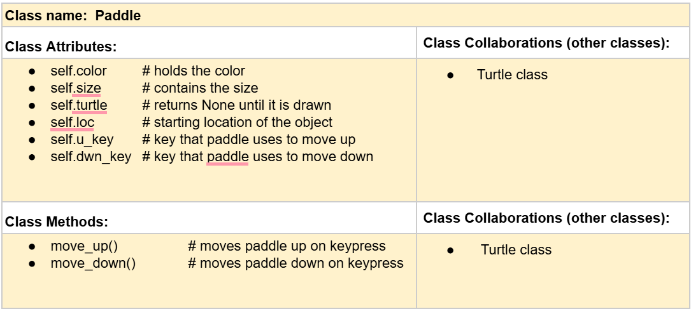
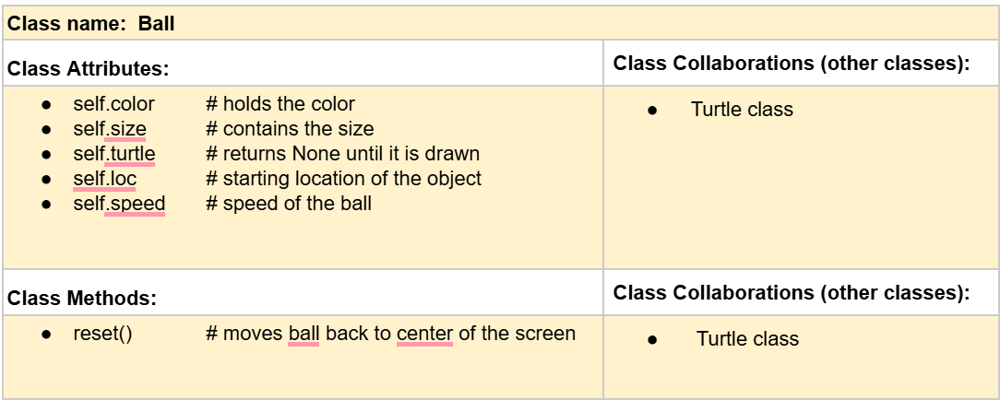
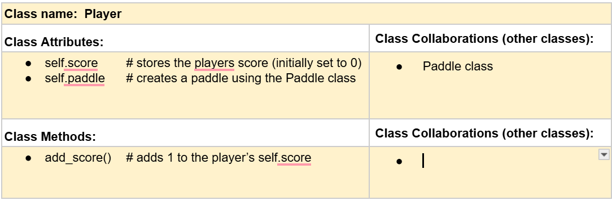

# CSC226 Final Project

## Instructions

️Exclamation Marks ❗️indicate action items; you should remove these emoji as you complete/update the items which 
  they accompany. (This means that your final README should have no ❗️in it!)

️**Author(s)**: Magnus McCaslin & Jaron Rhea

️**Google Doc Link**: https://docs.google.com/document/d/1BU3mu7FcAWBYw__MAPTMUFpFi1XchQNwqfwWQv53Krk/edit?usp=sharing

---

## Milestone 1: Setup, Planning, Design

️**Title**: `2-Player Pong`

  **Purpose**: `This program allows two user to play a classic game of Pong`

️**Source Assignment(s)**: `T11 & T12`

️**CRC Card(s)**:
  - Create a CRC card for each class that your project will implement.
  - See this link for a sample CRC card and a template to use for your own cards (you will have to make a copy to edit):
    [CRC Card Example](https://docs.google.com/document/d/1JE_3Qmytk_JGztRqkPXWACJwciPH61VCx3idIlBCVFY/edit?usp=sharing)
  - Tables in markdown are not easy, so we suggest saving your CRC card as an image and including the image(s) in the 
    README. You can do this by saving an image in the repository and linking to it. See the sample CRC card below - 
    and REPLACE it with your own:


[//]: # (  Images are located at p01-final-project-p01_mccaslinm_rheaj, incase they don't appear)
  

  

  

️**Branches**: This project will **require** effective use of git. 

Each partner should create a branch at the beginning of the project, and stay on this branch (or branches of their 
branch) as they work. When you need to bring each others branches together, do so by merging each other's branches 
into your own, following the process we've discussed in previous assignments, then re-branching out from the merged code.  

```
    Branch 1 starting name: mccaslinm
    Branch 2 starting name: rheaj
```

### References 

Throughout this project, you will likely use outside resources. Reference all ideas which are not your own, 
and describe how you integrated the ideas or code into your program. This includes online sources, people who have 
helped you, AI tools you've used, and any other resources that are not solely your own contribution. Update this 
section as you go. DO NOT forget about it!

https://www.geeksforgeeks.org/how-to-create-buttons-in-a-game-using-pygame/
https://www.youtube.com/watch?v=al_V4OGSvFU
https://www.101computing.net/pong-tutorial-using-pygame-adding-a-scoring-system/

---

## Milestone 2: Code Setup and Issue Queue

Most importantly, keep your issue queue up to date, and focus on your code. 🙃

Reflect on what you’ve done so far. How’s it going? Are you feeling behind/ahead? What are you worried about? 
What has surprised you so far? Describe your general feelings. Be honest with yourself; this section is for you, not me.

```
    The project as a whole is going well. We are feeling a bit behind and are worried mainly about learning the necessary tools to completing the tasks. 
```

---

## Milestone 3: Virtual Check-In

Indicate what percentage of the project you have left to complete and how confident you feel. 

️**Completion Percentage**: `60%`

️**Confidence**: Describe how confident you feel about completing this project, and why. Then, describe some 
  strategies you can employ to increase the likelihood that you'll be successful in completing this project 
  before the deadline.

```
    I am confident the project will be completed simply because it has to be done. Because of certain situations throughout working on it, the timing is definately a little behind, but the work that needs to be done will be done no matter what.
```

---

## Milestone 4: Final Code, Presentation, Demo

### User Instructions

In a paragraph, explain how to use your program. Assume the user is starting just after they hit the "Run" button 
in PyCharm. 

There will be two buttons: 'START' and 'QUIT'. 'QUIT' will close the game along with the window. 'START' will run the pong game. 2 People are required for the game, one user uses 'w' and 's' to move their paddle up and down, while the other uses the up and down arrow keys to do the same. The ball will be hit between both users' paddle and the goal is to not let it pass your paddle or else the opponent gets rewarded a point. Once the ball hits a paddle, it is sent back in the opposite direction. To return to the title screen, click the escape button. To restart the match, click 'r'.

### Errors and Constraints

Every program has bugs or features that had to be scrapped for time. These bugs should be tracked in the issue queue. 
You should already have a few items in here from the prior weeks. Create a new issue for any undocumented errors and 
deficiencies that remain in your code. Bugs found that aren't acknowledged in the queue will be penalized.

### Peer Evaluation

It is important that all members of your team contribute equitably. The peer evaluation is your chance to either 
a) celebrate the great work you all did together as an effective team, or b) indicate to the instructor if a member of
your team did not contribute their fair share. Grades will be adjusted for any team member who is evaluated poorly. Your
commit history will be used as evidence, so make sure you are using git effectively!

### Reflection

Each partner should write three to four well-written paragraphs address the following (at a minimum):
- Why did you select the project that you did?
- How closely did your final project reflect your initial design?
- What did you learn from this process?
- What was the hardest part of the final project?
- What would you do differently next time, knowing what you know now?
- How well did you work with your partner? What made it go well? What made it challenging?

```
    MM:     We selected the project because it was something simple that could be made 
        more challenging depending on what feautures we decided to add. Although we
        werent able to implement all of those feautures, it still offered it's fair 
        share of challenges. The initial design for this project was not followed 
        closely. I severely underestimated the amount of planning needed for the
        project. As we programmed more and more, Things would come up that I failed
        to consider while making the plan
            I learned the importance of coordination when working with a partner. We
        weren't always able to meet up often, which created situations where we would
        both program something and have to make drastic edits to it in order for it
        to fit in with the other's code. This was the most challenging part of the 
        project for me, coordinating with my partner so that we werent doing the same
        things. In the end, we managed to figure it out but more coordination in the 
        beginning would've been beneficial.
            The main thing I would do differently next time is give MUCH more thought 
        and time into the project design/plan. I would make sure that I am truly
        considering everything. Another thing would be to be more intentional about
        meeting up and communicating with my partner. We worked well together when we
        were physically together. It wasn't as well when we weren't in the same space.
        The communication was definetly the most challenging thing between us.
```

```
    JR:     This final projects was decided because it seemed like a fun and easy game for others to understand while 
    still being a challenge to code and implement various aspects of the game that were needed. we followed the project
     design quite closely. there were only a couple parts of the project that we had to drop all together because of 
     time constraints and how difficult they were. we were going to implement a single player mode but with the time 
     constraints we had as well as the difficulty of making it, we decided to scrap it. and the issue with the ball 
     phasing through the paddle at certain spots was difficult to fix because of out time constraint. 
            i learned that coding is not a task to be trifled with. it requires meticulous attention to detail, 
     especailly when you decide to use graphic design features. i found this out the hard way when i had to work on 
     this last minute everyday because of my workload in other classes. the hardest part of the project would be getting the ball to start bouncing randomly when the game started. 
            what i would do differently next time is dont wait to start and to choose easier classes to attend in the
     semester. this class was extremely difficult for me. 
     me and my partner worked well together when we were meeting in person but because of the complexity of our 
     code design, it was hard to communicate clearly. the hardest part of this project was definitely communication. seeing as both of our open times were during each others busy periods, we had no way to meet up and talk about our progress
```

---